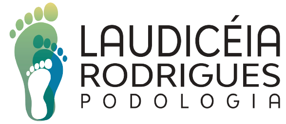

<p align="center">
  <a href="https://laudiceiapodologia.com" target="_blank">
    
  </a>
</p>

Projeto PHP com framework Laravel, Docker e MySQL.

## Para instalar as dependências

```bash
docker compose run composer install --ignore-platform-reqs
```

### Variáveis de ambiente

```bash
cp .env.example .env
```

### Gerar chave .env

```bash
docker compose run php php artisan key:generate
```

### Iniciar a aplicação em modo de desenvolvimento

```bash
docker compose up -d
```

### Configurando para produção, olhar documentação a seguir

 <a href="https://laravel.com/docs/9.x/deployment" target="_blank">
    Deployment
</a>
